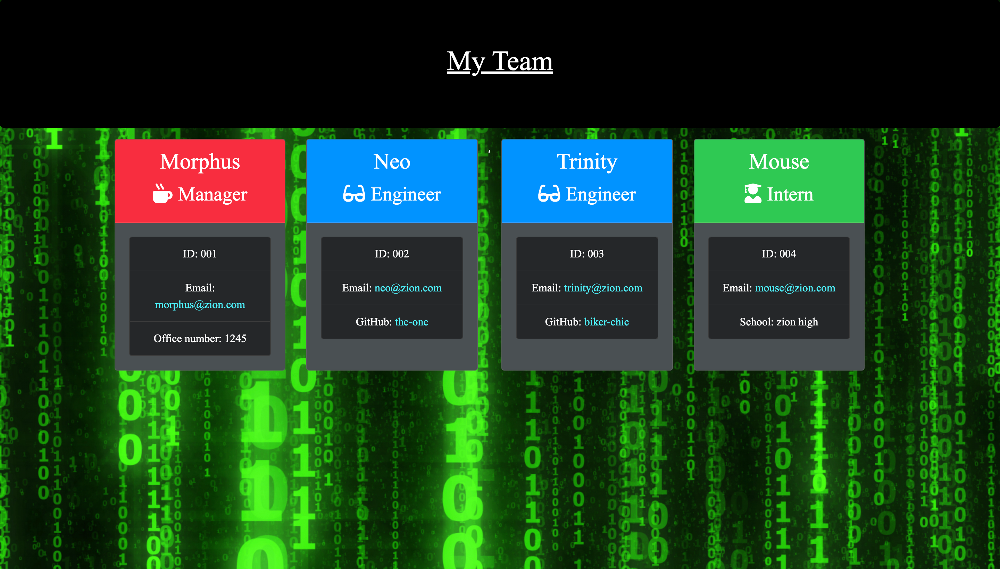

# Team Profile Generator

[](https://opensource.org/licenses/MIT)

## Contents

- [Team Profile Generator](#team-profile-generator)
  - [Contents](#contents)
    - [About](#about)
    - [User Story](#user-story)
    - [Screenshots:](#screenshots)
  - [Installation](#installation)
  - [Credits](#credits)
  - [Tests:](#tests)
  - [Contact Information:](#contact-information)

### About

A software engineering team-generator command line application. The application will prompt the user for information about the team manager and then information about the team members. The user can input any number of team members, and they may be a mix of engineers and interns. Then an html page is created that can be viewed in a web browser.

### User Story

    As a manager
    I want to generate a webpage that displays my team's basic info
    so that I have quick access to emails and GitHub profiles.

### Screenshots:





## Installation

```
npm install inquirer
npm install jest
git clone https://github.com/jj77847/team-profile-generator.git
cd team-profile-generator
npm install
node index.js
npm run app
```

## Credits

[Jonathan Jefferies](https://github.com/jj77847)

## Tests:

    npm run test

## Contact Information:

    *GitHub Username: jj77847
    *GitHub Email: jonathanjefferies1985@gmail.com

=======
